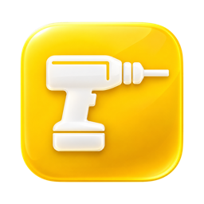
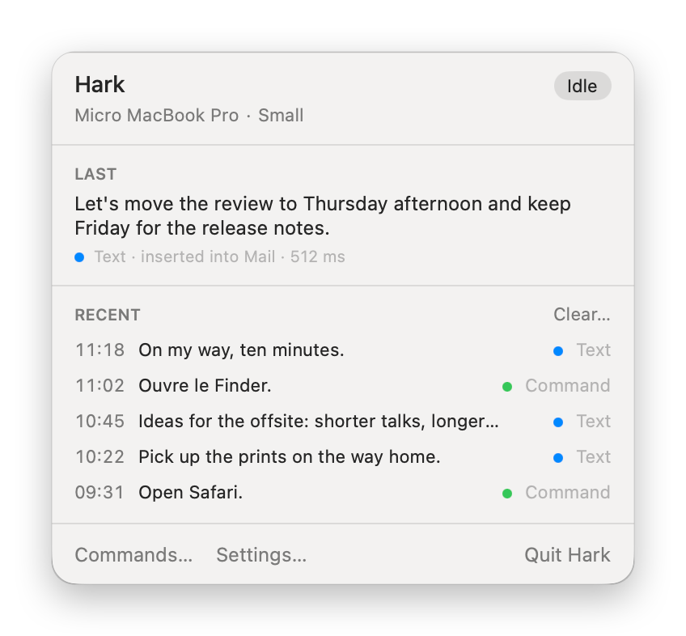
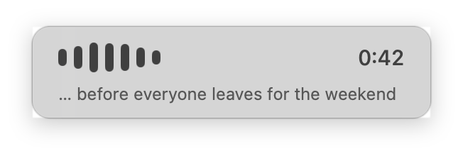
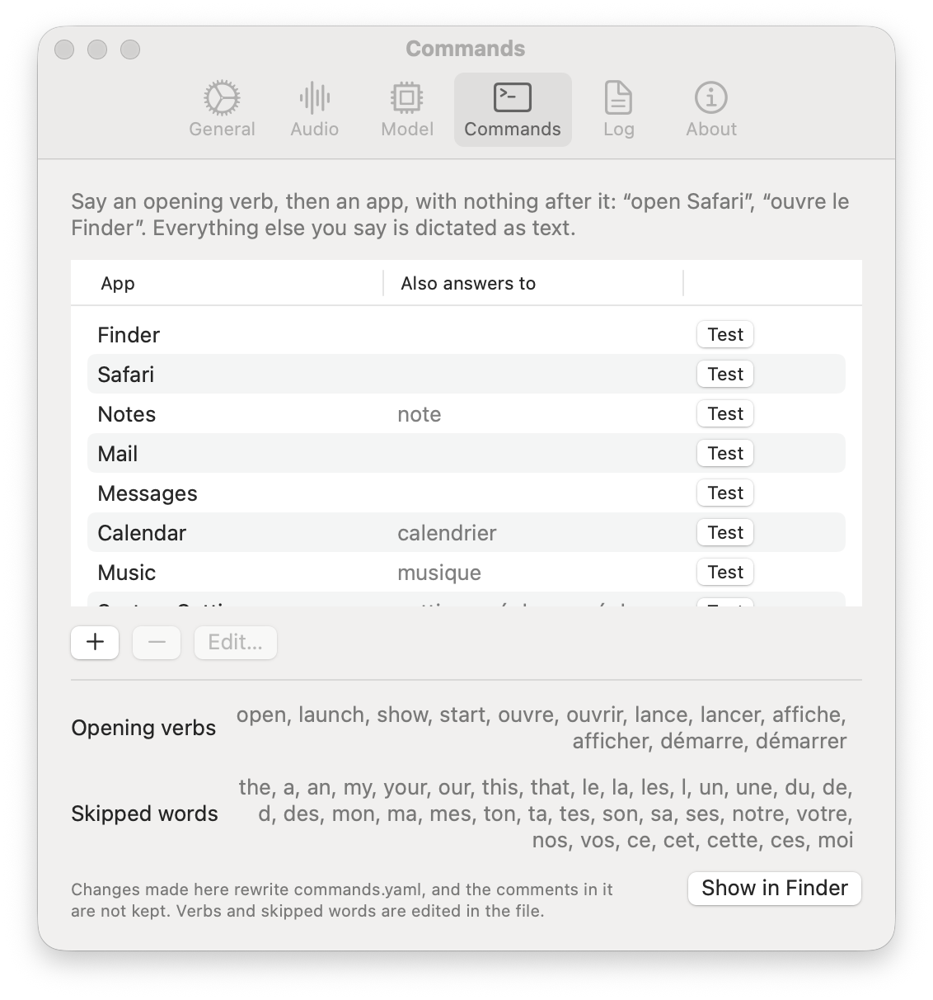
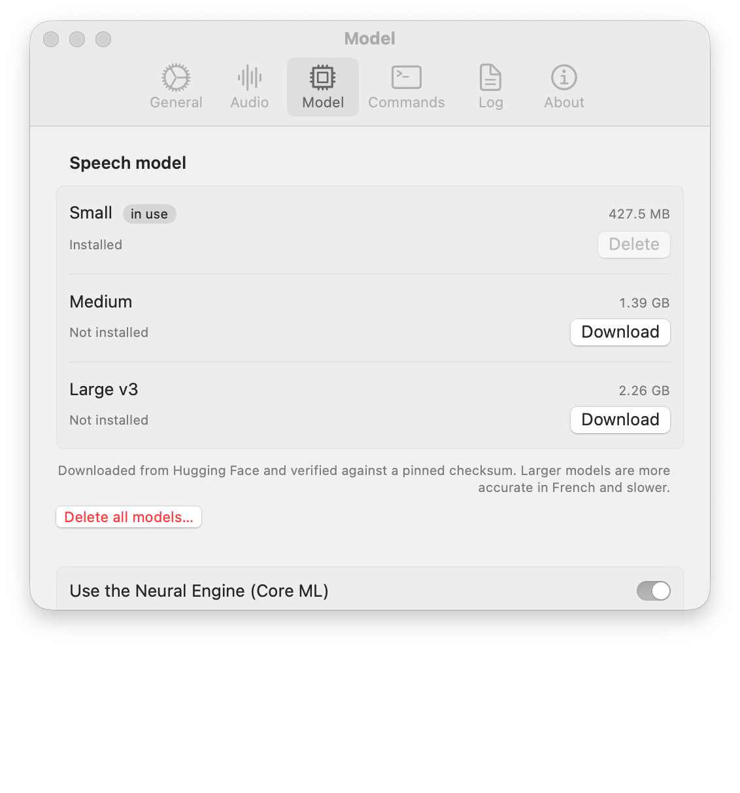

<p align="center">
  
</p>

<h1 align="center">Hark</h1>

<p align="center">
  A menu bar app for macOS. Press a key and speak: Hark types what you said where your cursor is,<br>
  or opens the app you named. Speech is transcribed on your Mac for privacy: it's standalone by design.
</p>

<p align="center">
  
</p>

## What it does

- **Dictation into the focused field.** Press ⌃⌥V to start and again to stop, or hold it and let go when you are done.
  ⌃⌥Esc cancels.
- **Voice commands.** An opening verb and an app, with nothing after it: "open Safari", "ouvre le Finder". Everything
  else you say is dictated as text.
- **Local transcription.** [whisper.cpp](https://github.com/ggml-org/whisper.cpp) on the GPU, with the Neural Engine
  for the encoder through Core ML. Three models to choose from: Small, Medium and Large v3.
- **English and French.** The language is detected on each utterance, or fixed in Settings. Settings, menus and
  notifications come in both.
- **The clipboard when there is no field.** If no text field has focus, the text is copied and a notification says
  so. Text for a password field is copied too, concealed, and kept out of the log.
- **A log you can read.** Every utterance writes one JSON line: what was heard, where it went, how long it took.

<p align="center">
  
</p>

While you speak, a small panel at the bottom of the screen shows your voice and the time. It never takes focus, so the
text lands where you were typing. Other audio is lowered until you stop. The live transcript is optional.

## Install

1. Download `Hark-0.0.2.dmg` from [Releases](https://github.com/isitanth/hark/releases), open it and drag Hark to
   Applications.
2. Hark is not signed with a Developer ID or notarized, so macOS blocks the first launch. Open System Settings ›
   Privacy & Security and click **Open Anyway** next to the message about Hark, or run
   `xattr -dr com.apple.quarantine /Applications/Hark.app` in Terminal.
3. Allow the microphone and Accessibility when Hark asks. Without Accessibility, dictated text only goes to the
   clipboard.
4. Download a model in Settings › Model. Small, 427.5 MB, is a good start.

Hark needs macOS 14 or later on Apple Silicon. Each release is signed ad hoc, so macOS treats an update as a new app:
if dictated text stops reaching fields after one, remove Hark from Privacy & Security › Accessibility and allow it
again.

## Settings

<p align="center">
  
  
</p>

Commands live in `~/Library/Application Support/Hark/commands.yaml`. The Commands tab edits that file, and Hark
reloads it whenever it changes. If an edit breaks it, Hark keeps the last good version and the menu bar icon says so.

```yaml
version: 2

defaults:
  threshold: 0.85        # how close a spoken app name has to be, from 0 to 1

open_verbs:
  en: [open, launch, show, start]
  fr: [ouvre, ouvrir, lance, lancer, affiche, afficher, démarre, démarrer]

commands:
  - id: open_notes
    action: open_app
    app: "Notes"
    aliases: ["note"]

apps:                    # how text goes into one app: accessibility, paste or clipboard
  "com.microsoft.VSCode":
    insert: paste
```

## The log

One file a day in `~/Library/Application Support/Hark/logs/`, one line per utterance. Here is one, spread out:

```json
{
  "ts": "2026-09-28T11:40:51.330+02:00",
  "duration_ms": 6300,
  "transcribe_ms": 512,
  "raw_text": "Let's move the review to Thursday afternoon.",
  "normalized_text": "let s move the review to thursday afternoon",
  "resolution": "text_inserted",
  "target_app": "com.apple.mail",
  "action_type": null,
  "exit_code": null,
  "error": null,
  "model_tier": "small"
}
```

`resolution` is `command`, `text_inserted`, `text_clipboard`, `discarded` or `failed`, and `error` says why when it
matters. Clear… in the panel and Settings › Log delete the files.

## Privacy

- No network access, except the model downloads you start. They come from Hugging Face at a pinned commit and are
  checked against a SHA-256 hash.
- Audio stays in memory. It is never written to disk.
- The log keeps what you dictated, on your Mac, until you clear it.

## Build from source

Needs Xcode 26 (Swift 6.2).

```bash
git clone https://github.com/isitanth/hark.git
cd hark
scripts/bundle.sh --install
```

`bundle.sh` builds `dist/Hark.app`, signs it, runs its self-test and, with `--install`, replaces
`/Applications/Hark.app`. It signs with your first Apple Development certificate, or with `HARK_SIGN_IDENTITY`. With
neither it signs ad hoc, and macOS asks for the microphone and Accessibility again after every build.
`scripts/check.sh` runs the lint, the builds and the tests, and `scripts/dmg.sh` packs `dist/Hark.app` into the disk
image the releases ship.

The code is one Swift package. `HarkCore` holds the logic and its tests: normalization, matching, action resolution,
the log. `HarkApp` is a thin SwiftUI layer on top, and `HarkObjC` is a one-function shim that turns AVFoundation's
Objective-C exceptions into errors. Each utterance runs through an explicit state machine: idle, capturing,
transcribing, resolving, then acting, inserting or copying.

## License

MIT, see [LICENSE](LICENSE). Hark includes [whisper.cpp](https://github.com/ggml-org/whisper.cpp),
[KeyboardShortcuts](https://github.com/sindresorhus/KeyboardShortcuts) and [Yams](https://github.com/jpsim/Yams), all
under MIT: see [THIRD_PARTY_NOTICES.md](THIRD_PARTY_NOTICES.md).
